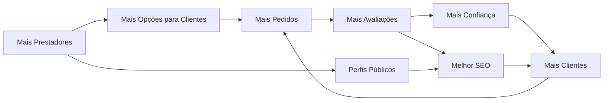

# 🚚 MudeJá — Visão Estratégica e Modelo de Negócio
## Parte 1/5 — Estratégia, Posicionamento e Monetização

---

## 1. VISÃO ESTRATÉGICA DO NEGÓCIO

### 1.1 Posicionamento

> **"O lugar mais confiável para encontrar mudanças, carretos e fretes locais."**

O MudeJá é um **marketplace horizontal de confiança** para serviços de mudança, carreto e frete local. Não é uma transportadora, não é um agregador logístico, não é um "Uber de mudanças". É uma **plataforma intermediadora** que conecta **quem precisa mover coisas** com **quem faz isso bem**, priorizando **confiança, reputação e proximidade geográfica**.

| Dimensão | Posicionamento |
|---|---|
| **Categoria** | Marketplace de serviços locais |
| **Segmento** | Mudanças residenciais, carretos, fretes pequenos |
| **Diferencial** | Trust-first, reputação verificável, discovery local |
| **Modelo mental** | "A Babysits das mudanças" |
| **Público** | Classes B/C urbanas, 25-55 anos |
| **Geografia** | Cidades brasileiras 200k+ habitantes |

### 1.2 Problema Resolvido

| Dor do Cliente | Dor do Prestador |
|---|---|
| Não sabe quem contratar | Depende de indicação boca-a-boca |
| Medo de golpe/roubo | Não tem presença digital |
| Preços sem referência | Não consegue mostrar reputação |
| Difícil comparar opções | Não recebe leads qualificados |
| Sem garantia de qualidade | Sazonalidade mata o negócio |
| Processo manual (WhatsApp, boca-a-boca) | Concorre com informais sem diferenciação |

### 1.3 Proposta de Valor

**Para Clientes:**
- Encontre prestadores verificados perto de você
- Compare avaliações reais de outros clientes
- Receba propostas sem sair de casa
- Contrate com confiança, não com sorte

**Para Prestadores:**
- Receba oportunidades de trabalho na sua região
- Construa uma reputação verificável e pública
- Destaque-se da concorrência informal
- Cresça seu negócio com visibilidade digital

**Para o Ecossistema:**
- Formalização gradual do mercado
- Redução de fraudes
- Transparência de preços
- Profissionalização do setor

### 1.4 Por Que Esse Modelo Funciona

#### Lições dos Marketplaces Trust-Based

```
Babysits → Modelo de referência direta
├── Plataforma leve, sem operação própria
├── Foco em confiança e reputação
├── Crescimento geográfico progressivo
├── Monetização por assinatura, não comissão
└── Efeito de rede local poderoso

GetNinjas → Modelo de leads
├── Créditos para contato com clientes
├── Diversidade de categorias
├── Alto volume, baixa curação
└── Monetização por lead

99 / iFood → Modelo de comissão
├── Alta operação
├── Comissão por transação
├── Tracking realtime
└── Complexidade operacional ALTA ← EVITAR no MVP
```

O MudeJá combina o melhor dos dois primeiros modelos:
- **Trust system da Babysits** → confiança como produto
- **Modelo de leads/assinatura do GetNinjas** → monetização simples
- **Sem a complexidade operacional** de plataformas de comissão

#### Por que marketplaces locais escalam

1. **Efeito de rede local**: mais prestadores → mais clientes → mais prestadores (em cada cidade)
2. **Winner-takes-most por cidade**: quem domina primeiro uma cidade, mantém
3. **SEO local é defensável**: páginas indexadas por cidade criam moat orgânico
4. **CAC decresce com densidade**: quanto mais avaliações, mais conversão orgânica
5. **Mudança é recorrente indireta**: quem muda indica, quem é indicado volta

### 1.5 Público-Alvo

#### Clientes (Demand Side)

| Persona | Descrição | Frequência |
|---|---|---|
| **Universitário migrante** | 18-25, primeira mudança, budget limitado | 1-2x/ano |
| **Jovem casal** | 25-35, mudança residencial, precisa de confiança | 1x/2 anos |
| **Família em crescimento** | 30-45, mudança maior, alto ticket | 1x/3-5 anos |
| **Profissional relocado** | 25-40, mudança corporativa, quer praticidade | 1x/2-3 anos |
| **Comerciante local** | 30-55, frete de mercadoria, recorrente | Mensal |
| **Vendedor online** | 20-45, frete de marketplace (OLX, ML) | Semanal |

#### Prestadores (Supply Side)

| Persona | Descrição | Volume |
|---|---|---|
| **Carreteiro individual** | 1 caminhonete, trabalha sozinho | 5-15 serviços/mês |
| **Micro empresa de mudança** | 2-5 funcionários, caminhão baú | 10-30 serviços/mês |
| **Empresa de mudanças** | 5-20 funcionários, frota | 30-100 serviços/mês |
| **Fretista** | Utilitário/van, fretes pequenos | 20-50 serviços/mês |
| **Transportador autônomo** | Caminhão próprio, frete diversificado | 10-20 serviços/mês |

### 1.6 Estratégia Geográfica

```
Fase 1 (MVP): 1 cidade anchor (Curitiba)
├── Densidade mínima: 50 prestadores ativos
├── Meta: 200 pedidos/mês
├── Foco: reputação + liquidez local
│
Fase 2: 3-5 capitais do Sul/Sudeste
├── São Paulo, Porto Alegre, Florianópolis, Belo Horizonte
├── Replicar playbook de Curitiba
├── Meta: 1000 pedidos/mês total
│
Fase 3: Top 20 cidades brasileiras
├── Capitais + cidades 500k+
├── SEO programático como motor
├── Meta: 5000 pedidos/mês total
│
Fase 4: Escala nacional
├── Cidades 200k+
├── Operação descentralizada
├── Meta: 20.000+ pedidos/mês
```

> [!IMPORTANT]
> **Regra de ouro**: NÃO expandir para uma nova cidade até que a cidade atual tenha **liquidez mínima** (>80% dos pedidos recebem pelo menos 3 propostas em 24h).

### 1.7 Estratégia de Liquidez

O maior risco de um marketplace é o **cold start** — a galinha e o ovo. A estratégia:

```
1. SUPPLY-FIRST: começar recrutando prestadores
   ├── Custo de aquisição baixo (grátis no início)
   ├── Prestadores trazem clientes naturalmente
   └── Perfis públicos geram SEO

2. SINGLE-PLAYER MODE: valor mesmo sem match
   ├── Prestador: perfil público funciona como "cartão digital"
   ├── Prestador: pode compartilhar perfil no WhatsApp
   ├── Cliente: pode pesquisar e comparar mesmo sem publicar
   └── SEO atrai tráfego mesmo com poucos prestadores

3. MANAGED SUPPLY inicial
   ├── Curadoria manual dos primeiros 50 prestadores
   ├── Ligações diretas para validar e ativar
   ├── Onboarding assistido (preencher perfil juntos)
   └── Primeiras avaliações seed (serviços reais verificados)

4. ESCASSEZ ARTIFICIAL
   ├── "Vagas limitadas para prestadores na sua região"
   ├── Fila de espera para novas regiões
   └── Exclusividade percebida
```

### 1.8 Efeito de Rede



### 1.9 Visão de Escala

| Horizonte | Visão |
|---|---|
| **6 meses** | Marketplace funcional em 1 cidade, 50+ prestadores, 200+ pedidos/mês |
| **12 meses** | 3-5 cidades, 300+ prestadores, 1.000+ pedidos/mês, monetização ativa |
| **24 meses** | 10-15 cidades, 1.500+ prestadores, 5.000+ pedidos/mês, break-even |
| **36 meses** | 20+ cidades, 5.000+ prestadores, 15.000+ pedidos/mês, lucrativo |
| **48 meses** | Nacional, 15.000+ prestadores, 50.000+ pedidos/mês, líder de categoria |

---

## 2. MODELO DE NEGÓCIO

### 2.1 Modelo Marketplace

O MudeJá opera como **marketplace intermediador puro**:

- **NÃO** emprega prestadores
- **NÃO** define preços
- **NÃO** processa pagamentos entre as partes (inicialmente)
- **NÃO** é responsável pela execução do serviço
- **CONECTA** oferta e demanda
- **ORGANIZA** reputação e confiança
- **MONETIZA** acesso e visibilidade

### 2.2 Estratégia de Monetização

#### Fase MVP (0-6 meses): Gratuito com limites

| Feature | Free | Objetivo |
|---|---|---|
| Criar perfil | ✅ | Gerar supply |
| Receber leads | 3/mês | Criar necessidade |
| Enviar propostas | 3/mês | Criar necessidade |
| Perfil público | Básico | SEO |
| Avaliações | ✅ | Trust |

> **Objetivo**: adquirir massa crítica de prestadores e clientes sem fricção de pagamento.

#### Fase Monetização (6-12 meses): Freemium + Leads

| Receita | Modelo | Preço estimado |
|---|---|---|
| **Assinatura PRO** | Mensal | R$ 49-99/mês |
| **Créditos de Lead** | Pay-per-lead | R$ 5-15/lead |
| **Destaque Patrocinado** | Boost de perfil | R$ 29-79/mês |
| **Selo Verificado Premium** | Verificação avançada | R$ 19/mês |

#### Fase Escala (12-24 meses): Comissão opcional

| Receita | Modelo | Taxa |
|---|---|---|
| **Comissão por match** | % sobre serviço fechado | 5-10% |
| **Pagamento in-app** | Escrow opcional | 2-3% + taxa fixa |
| **Seguros** | Parceria com seguradoras | Comissão affiliate |

### 2.3 Plano PRO — Detalhamento

| Feature | Free | PRO (R$79/mês) |
|---|---|---|
| Perfil público | Básico | Completo + destaque |
| Leads/mês | 3 | Ilimitados |
| Propostas/mês | 3 | Ilimitadas |
| Posição no ranking | Natural | Prioridade |
| Selo PRO | ❌ | ✅ |
| Fotos no perfil | 3 | 15 |
| Vídeo institucional | ❌ | ✅ |
| Estatísticas | Básicas | Avançadas |
| Suporte | Padrão | Prioritário |
| Destaque em busca | ❌ | ✅ |
| Área de atuação | 1 bairro | Cidade inteira |

### 2.4 Modelo de Leads

```
Cliente publica pedido de mudança
        │
        ▼
Sistema identifica prestadores compatíveis (geolocalização + tipo)
        │
        ▼
Prestadores Free: veem resumo do pedido (bairro, tipo, data)
Prestadores PRO: veem detalhes completos + contato
        │
        ▼
Prestador Free: gasta 1 crédito para desbloquear + enviar proposta
Prestador PRO: envia proposta direto (ilimitado)
        │
        ▼
Cliente recebe propostas e escolhe
        │
        ▼
Redirecionamento para WhatsApp para combinar detalhes
```

### 2.5 Destaque Patrocinado

```
Resultados de busca:
┌─────────────────────────────────┐
│ ⭐ DESTAQUE                      │
│ João Mudanças - ★★★★★ (47)      │  ← Patrocinado (R$79/mês)
│ Curitiba - Atende toda cidade    │
│ "Mudança completa com cuidado"   │
├─────────────────────────────────┤
│ 🏆 PRO                           │
│ Carlos Fretes - ★★★★☆ (23)      │  ← Assinante PRO (R$79/mês)
│ Curitiba - Centro/Batel          │
├─────────────────────────────────┤
│ Maria Carretos - ★★★★☆ (12)     │  ← Free
│ Curitiba - Portão/Santa Felicid. │
├─────────────────────────────────┤
│ Pedro Mudanças - ★★★☆☆ (5)      │  ← Free
│ Curitiba - Pinheirinho           │
└─────────────────────────────────┘
```

### 2.6 Unit Economics Iniciais

#### Por Prestador PRO

| Métrica | Valor |
|---|---|
| Receita mensal | R$ 79 |
| Custo de aquisição (CAC) | R$ 30-50 |
| Custo de servir (infra + suporte) | R$ 5/mês |
| Margem bruta | R$ 74/mês |
| Payback | < 1 mês |
| Churn estimado | 8-12%/mês |
| LTV (8 meses médio) | R$ 632 |
| LTV/CAC | 12-21x |

#### Por Lead Avulso

| Métrica | Valor |
|---|---|
| Preço por lead | R$ 10 |
| Custo marginal | ~R$ 0,50 |
| Margem bruta | R$ 9,50 |
| Conversão lead → serviço | 15-25% |
| Ticket médio serviço | R$ 300-800 |

#### Projeção MVP (6 meses)

| Mês | Prestadores | PRO | Leads avulsos | Receita |
|---|---|---|---|---|
| 1 | 20 | 0 | 0 | R$ 0 |
| 2 | 40 | 0 | 0 | R$ 0 |
| 3 | 60 | 5 | 50 | R$ 895 |
| 4 | 80 | 12 | 120 | R$ 2.148 |
| 5 | 100 | 22 | 200 | R$ 3.738 |
| 6 | 130 | 35 | 300 | R$ 5.765 |

### 2.7 Estratégia de Retenção de Prestadores

| Tática | Objetivo |
|---|---|
| Leads recorrentes | Valor tangível contínuo |
| Reputação acumulada | Lock-in por reputação |
| Perfil público no Google | Presença digital gratuita |
| Estatísticas de performance | Gamificação leve |
| Badge PRO visível | Status e diferenciação |
| Suporte prioritário | Percepção de valor |
| Destaques sazonais | Pico de demanda = pico de valor |
| Programa de indicação | Prestador indica prestador |

### 2.8 Riscos e Mitigações

| Risco | Probabilidade | Impacto | Mitigação |
|---|---|---|---|
| Cold start (sem liquidez) | Alta | Crítico | Supply-first + single-player mode |
| Desintermediação (bypass) | Alta | Alto | Trust + reputação como lock-in |
| Fraude de prestadores | Média | Alto | Verificação + trust score |
| Concorrência de incumbentes | Média | Médio | Foco local + SEO + nicho |
| Baixa retenção PRO | Média | Alto | Valor tangível (leads) + lock-in |
| Regulação adversa | Baixa | Alto | Modelo intermediador puro |
| Sazonalidade extrema | Média | Médio | Diversificação (frete + carreto) |

### 2.9 Decisões Estratégicas Justificadas

| Decisão | Justificativa |
|---|---|
| **Começar sem pagamento in-app** | Reduz complexidade, regulação e fricção. WhatsApp é suficiente para MVP. |
| **Assinatura > Comissão no MVP** | Receita previsível, sem necessidade de tracking de transação. |
| **Supply-first** | Prestadores são mais fáceis de recrutar e trazem clientes organicamente. |
| **Uma cidade primeiro** | Densidade > Cobertura. Melhor 100% em 1 cidade que 10% em 10. |
| **WhatsApp como canal** | 99% dos brasileiros usam. Sem fricção. Sem custo de chat. |
| **Firebase/Supabase** | Custo baixo, velocidade de desenvolvimento, serverless, escala automática. |
| **React Native Expo** | Um codebase, dois apps (iOS + Android), desenvolvimento rápido. |
| **Next.js para SEO** | SSR/SSG para páginas públicas indexáveis. Motor de aquisição orgânica. |

---

> [!NOTE]
> Este documento é a Parte 1/5 da documentação completa do MudeJá.
> Continua em: Parte 2 (Arquitetura e Banco de Dados), Parte 3 (Trust, Antifraude e UX), Parte 4 (SEO, Growth e Operações), Parte 5 (Roadmap, KPIs e Escala).
