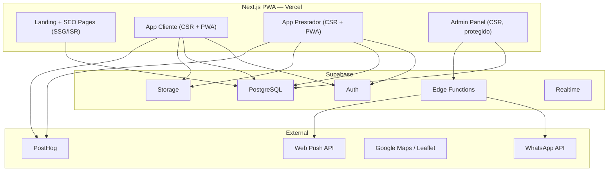

# 🏗️ MudeJá — Arquitetura do Sistema (v2 — PWA)
## Parte 2/5 — Next.js PWA Único + Supabase

---

## 3. ARQUITETURA DO SISTEMA

### 3.1 Decisão Arquitetural: Monolito Web PWA

> **Uma aplicação Next.js que faz TUDO**: landing, SEO, app do cliente, app do prestador, admin.



### 3.2 Por que PWA > App Nativo no MVP

| Vantagem | Impacto |
|---|---|
| **1 codebase** | 1 dev faz tudo |
| **Deploy instantâneo** | Sem review da Apple/Google |
| **SEO nativo** | Next.js SSR/SSG, sem web separada |
| **PWA instalável** | "Adicionar à tela inicial" no Android/iOS |
| **Web Push** | Notificações funcionam |
| **Custo zero de stores** | Sem R$99/ano Apple + R$25 Google |
| **Iteração rápida** | Deploy em segundos via Vercel |
| **Link sharing** | Qualquer página é compartilhável |
| **Stack familiar** | React + TypeScript + Supabase |

### 3.3 Stack Tecnológico Definitivo

| Camada | Tecnologia |
|---|---|
| **Framework** | Next.js 15 (App Router) |
| **Linguagem** | TypeScript |
| **Styling** | Tailwind CSS 4 + shadcn/ui |
| **Estado global** | Zustand |
| **Data fetching** | TanStack Query v5 |
| **Forms** | React Hook Form + Zod |
| **Auth** | Supabase Auth (phone OTP + Google + Apple) |
| **Backend** | Supabase (PostgreSQL + Edge Functions + Storage + Realtime) |
| **Maps** | Leaflet (gratuito) ou Google Maps |
| **Push** | Web Push API + Supabase Edge Functions |
| **Analytics** | PostHog |
| **Error tracking** | Sentry |
| **Deploy** | Vercel |
| **PWA** | next-pwa / @serwist/next |
| **Icons** | Lucide React |
| **Fonts** | Google Fonts (Inter) |

### 3.4 Estrutura de Pastas

```
mudeja/
├── public/
│   ├── manifest.json              # PWA manifest
│   ├── sw.js                      # Service worker (gerado)
│   ├── icons/                     # PWA icons (192, 512)
│   ├── og/                        # Open Graph images
│   └── images/                    # Assets estáticos
│
├── src/
│   ├── app/                       # Next.js App Router
│   │   ├── layout.tsx             # Root layout (fonts, metadata, providers)
│   │   ├── page.tsx               # Landing page (SSG)
│   │   ├── manifest.ts            # Dynamic PWA manifest
│   │   ├── sitemap.ts             # Dynamic sitemap
│   │   ├── robots.ts              # Robots.txt
│   │   │
│   │   ├── (public)/              # Páginas públicas (SEO)
│   │   │   ├── layout.tsx
│   │   │   ├── como-funciona/page.tsx
│   │   │   ├── para-prestadores/page.tsx
│   │   │   ├── precos/page.tsx
│   │   │   ├── termos/page.tsx
│   │   │   ├── privacidade/page.tsx
│   │   │   ├── blog/
│   │   │   │   ├── page.tsx
│   │   │   │   └── [slug]/page.tsx
│   │   │   ├── [cidade]/              # SEO programático
│   │   │   │   ├── page.tsx           # /curitiba
│   │   │   │   ├── mudanca/page.tsx   # /curitiba/mudanca
│   │   │   │   ├── carreto/page.tsx   # /curitiba/carreto
│   │   │   │   ├── frete/page.tsx     # /curitiba/frete
│   │   │   │   └── [bairro]/page.tsx  # /curitiba/batel
│   │   │   └── prestador/
│   │   │       └── [slug]/page.tsx    # /prestador/joao-mudancas
│   │   │
│   │   ├── (auth)/                # Páginas de autenticação
│   │   │   ├── layout.tsx
│   │   │   ├── login/page.tsx
│   │   │   ├── cadastro/page.tsx
│   │   │   ├── verificar/page.tsx     # OTP verification
│   │   │   └── onboarding/
│   │   │       ├── page.tsx           # Escolher tipo (cliente/prestador)
│   │   │       ├── cliente/page.tsx
│   │   │       └── prestador/page.tsx
│   │   │
│   │   ├── (app)/                 # App autenticado (CSR, PWA)
│   │   │   ├── layout.tsx         # App shell + bottom nav + auth guard
│   │   │   ├── page.tsx           # Home (redirect baseado no role)
│   │   │   │
│   │   │   ├── cliente/           # Área do cliente
│   │   │   │   ├── page.tsx       # Dashboard / buscar prestadores
│   │   │   │   ├── novo-pedido/page.tsx
│   │   │   │   ├── meus-pedidos/
│   │   │   │   │   ├── page.tsx
│   │   │   │   │   └── [id]/page.tsx
│   │   │   │   ├── propostas/
│   │   │   │   │   └── [id]/page.tsx
│   │   │   │   ├── favoritos/page.tsx
│   │   │   │   └── avaliar/[id]/page.tsx
│   │   │   │
│   │   │   ├── prestador/        # Área do prestador
│   │   │   │   ├── page.tsx       # Dashboard / oportunidades
│   │   │   │   ├── oportunidades/page.tsx
│   │   │   │   ├── minhas-propostas/
│   │   │   │   │   ├── page.tsx
│   │   │   │   │   └── [id]/page.tsx
│   │   │   │   ├── meu-perfil/
│   │   │   │   │   ├── page.tsx       # Visualizar
│   │   │   │   │   └── editar/page.tsx
│   │   │   │   ├── veiculos/page.tsx
│   │   │   │   ├── avaliacoes/page.tsx
│   │   │   │   └── estatisticas/page.tsx
│   │   │   │
│   │   │   ├── notificacoes/page.tsx
│   │   │   ├── configuracoes/
│   │   │   │   ├── page.tsx
│   │   │   │   ├── plano/page.tsx
│   │   │   │   └── conta/page.tsx
│   │   │   └── denunciar/page.tsx
│   │   │
│   │   └── admin/                 # Painel admin (protegido por role)
│   │       ├── layout.tsx         # Admin layout (sidebar)
│   │       ├── page.tsx           # Dashboard
│   │       ├── usuarios/page.tsx
│   │       ├── prestadores/page.tsx
│   │       ├── pedidos/page.tsx
│   │       ├── denuncias/page.tsx
│   │       ├── avaliacoes/page.tsx
│   │       ├── financeiro/page.tsx
│   │       ├── cidades/page.tsx
│   │       └── configuracoes/page.tsx
│   │
│   ├── components/
│   │   ├── ui/                    # shadcn/ui components
│   │   │   ├── button.tsx
│   │   │   ├── input.tsx
│   │   │   ├── card.tsx
│   │   │   ├── dialog.tsx
│   │   │   ├── sheet.tsx          # Mobile bottom sheets
│   │   │   ├── badge.tsx
│   │   │   └── ...
│   │   ├── layout/
│   │   │   ├── Navbar.tsx         # Public navbar
│   │   │   ├── Footer.tsx
│   │   │   ├── BottomNav.tsx      # App mobile bottom navigation
│   │   │   ├── AppShell.tsx       # PWA app wrapper
│   │   │   ├── AdminSidebar.tsx
│   │   │   └── InstallPWA.tsx     # PWA install prompt
│   │   ├── provider/
│   │   │   ├── ProviderCard.tsx
│   │   │   ├── ProviderProfile.tsx
│   │   │   ├── ProviderBadges.tsx
│   │   │   ├── ProviderPhotos.tsx
│   │   │   └── ProviderStats.tsx
│   │   ├── request/
│   │   │   ├── RequestForm.tsx    # Multi-step form
│   │   │   ├── RequestCard.tsx
│   │   │   ├── RequestDetails.tsx
│   │   │   └── RequestItems.tsx
│   │   ├── proposal/
│   │   │   ├── ProposalForm.tsx
│   │   │   ├── ProposalCard.tsx
│   │   │   └── ProposalDetails.tsx
│   │   ├── review/
│   │   │   ├── ReviewForm.tsx
│   │   │   ├── ReviewCard.tsx
│   │   │   └── StarRating.tsx
│   │   ├── search/
│   │   │   ├── SearchBar.tsx
│   │   │   ├── SearchFilters.tsx
│   │   │   └── SearchResults.tsx
│   │   └── shared/
│   │       ├── TrustScore.tsx
│   │       ├── LocationPicker.tsx
│   │       ├── PhotoUpload.tsx
│   │       ├── WhatsAppButton.tsx
│   │       ├── EmptyState.tsx
│   │       └── LoadingSkeleton.tsx
│   │
│   ├── hooks/
│   │   ├── useAuth.ts
│   │   ├── useProfile.ts
│   │   ├── useRequests.ts
│   │   ├── useProposals.ts
│   │   ├── useProviders.ts
│   │   ├── useReviews.ts
│   │   ├── useLocation.ts
│   │   ├── useNotifications.ts
│   │   ├── usePWA.ts              # Install prompt, online status
│   │   └── useMediaQuery.ts       # Responsive hooks
│   │
│   ├── lib/
│   │   ├── supabase/
│   │   │   ├── client.ts          # Browser client
│   │   │   ├── server.ts          # Server client (RSC)
│   │   │   ├── middleware.ts      # Auth middleware
│   │   │   └── types.ts           # Generated types
│   │   ├── utils.ts               # cn() + helpers
│   │   ├── constants.ts
│   │   ├── validators.ts          # Zod schemas
│   │   └── formatters.ts          # Preço, data, distância
│   │
│   ├── stores/
│   │   ├── authStore.ts           # Zustand
│   │   └── appStore.ts            # Zustand
│   │
│   └── types/
│       ├── database.ts            # Supabase generated types
│       ├── api.ts
│       └── index.ts
│
├── supabase/
│   ├── migrations/                # SQL migrations
│   │   ├── 00001_initial_schema.sql
│   │   ├── 00002_rls_policies.sql
│   │   ├── 00003_triggers.sql
│   │   └── 00004_trust_functions.sql
│   ├── functions/                 # Edge Functions
│   │   ├── match-providers/index.ts
│   │   ├── calculate-trust/index.ts
│   │   ├── send-notification/index.ts
│   │   └── whatsapp-redirect/index.ts
│   └── seed.sql
│
├── next.config.ts
├── tailwind.config.ts
├── tsconfig.json
├── package.json
└── .env.local
```

### 3.5 Rendering Strategy

| Rota | Rendering | Motivo |
|---|---|---|
| `/` (landing) | SSG | Performance + SEO |
| `/[cidade]/*` | ISR (1h) | SEO + dados semi-dinâmicos |
| `/prestador/[slug]` | ISR (30min) | SEO + avaliações atualizadas |
| `/blog/*` | SSG | SEO puro |
| `/como-funciona` | SSG | Estático |
| `/(auth)/*` | CSR | Interativo, sem SEO |
| `/(app)/*` | CSR | App privado, sem SEO |
| `/admin/*` | CSR | Privado, sem SEO |

### 3.6 PWA Configuration

```json
// public/manifest.json
{
  "name": "MudeJá - Mudanças e Fretes",
  "short_name": "MudeJá",
  "description": "Encontre prestadores confiáveis para mudanças e fretes",
  "start_url": "/cliente",
  "display": "standalone",
  "orientation": "portrait",
  "theme_color": "#0F172A",
  "background_color": "#0F172A",
  "icons": [
    { "src": "/icons/icon-192.png", "sizes": "192x192", "type": "image/png" },
    { "src": "/icons/icon-512.png", "sizes": "512x512", "type": "image/png" },
    { "src": "/icons/icon-512-maskable.png", "sizes": "512x512", "type": "image/png", "purpose": "maskable" }
  ],
  "screenshots": [
    { "src": "/screenshots/home.png", "sizes": "390x844", "type": "image/png", "form_factor": "narrow" }
  ]
}
```

### 3.7 Mobile-First App Shell

```
Quando logado, a experiência é "app-like":

┌─────────────────────────────┐
│ ← MudeJá          🔔  ⚙️  │  ← Top bar (fixo)
├─────────────────────────────┤
│                             │
│    Conteúdo da página       │  ← Scroll area
│    (ocupa 100vh - navs)     │
│                             │
│                             │
├─────────────────────────────┤
│ 🏠  🔍  ➕  💬  👤        │  ← Bottom nav (fixo, mobile only)
│ Home Busca Novo Msgs Perfil │
└─────────────────────────────┘

- Bottom nav aparece apenas em telas < 768px
- Em desktop: sidebar lateral
- Transições suaves entre páginas
- Pull-to-refresh via touch events
- Gestos de swipe para voltar (opcional)
```

### 3.8 Autenticação

```
Fluxo:
1. /login → telefone (SMS OTP via Supabase) ou Google/Apple
2. Supabase Auth verifica → session cookie
3. Middleware Next.js verifica session em rotas /(app)/* e /admin/*
4. Se não autenticado → redirect /login
5. Se autenticado sem perfil → redirect /onboarding
6. Se autenticado com perfil → home baseada no role
```

```typescript
// src/middleware.ts
import { createServerClient } from '@supabase/ssr'
import { NextResponse } from 'next/server'

export async function middleware(request) {
  const supabase = createServerClient(/* ... */)
  const { data: { session } } = await supabase.auth.getSession()
  
  // Rotas protegidas
  if (request.nextUrl.pathname.startsWith('/cliente') || 
      request.nextUrl.pathname.startsWith('/prestador')) {
    if (!session) return NextResponse.redirect('/login')
  }
  
  // Admin protegido por role
  if (request.nextUrl.pathname.startsWith('/admin')) {
    if (!session) return NextResponse.redirect('/login')
    const { data: user } = await supabase
      .from('users').select('role').eq('id', session.user.id).single()
    if (user?.role !== 'admin') return NextResponse.redirect('/')
  }
}
```

### 3.9 Web Push Notifications

```typescript
// Service Worker registration + push subscription
// Funciona em Android (Chrome, Edge, Firefox, Samsung Internet)
// iOS Safari 16.4+ suporta Web Push em PWAs instaladas

Eventos que geram push:
├── Nova oportunidade na região (prestador)
├── Nova proposta recebida (cliente)
├── Proposta aceita (prestador)
├── Lembrete de avaliação (ambos)
├── Perfil verificado (prestador)
└── Badge conquistado (prestador)

Stack: 
Supabase DB trigger → Edge Function → Web Push API → Browser
```

### 3.10 Supabase Backend

```
Supabase Project
├── PostgreSQL
│   ├── PostGIS extension (geolocalização)
│   ├── pg_cron (jobs agendados)
│   └── pgcrypto (hashing)
├── Auth
│   ├── Phone OTP (Twilio/MessageBird)
│   ├── Google OAuth
│   └── Apple Sign-In
├── Storage
│   ├── avatars/ (fotos de perfil)
│   ├── vehicles/ (fotos de veículos)
│   ├── requests/ (fotos de mudanças)
│   ├── documents/ (documentos verificação)
│   └── providers/ (fotos de serviço)
├── Edge Functions
│   ├── match-providers (matching algorithm)
│   ├── calculate-trust (trust score)
│   ├── send-notification (web push)
│   └── admin-actions (ações administrativas)
└── Realtime
    └── notifications (listener de novas notificações)
```

### 3.11 Infraestrutura e Deploy

```
Vercel
├── Next.js PWA → deploy automático via Git
├── Preview deploys por branch/PR
├── Edge middleware (auth)
├── Analytics built-in
└── Domínio: mudeja.com.br

Supabase (Hosted)
├── Free tier → MVP
├── Pro tier (R$125/mês) → quando escalar
└── Backups automáticos

Monitoring
├── Sentry → error tracking
├── PostHog → product analytics (self-hosted grátis ou cloud)
├── Vercel Analytics → web vitals
└── Supabase Dashboard → DB metrics

CI/CD
├── GitHub → push to main = deploy
├── Preview branches para QA
├── Supabase CLI → migrations automáticas
└── TypeScript strict mode
```

### 3.12 Performance Targets

| Métrica | Target | Como |
|---|---|---|
| LCP | <2.5s | SSG/ISR + CDN Vercel |
| FID | <100ms | Minimal JS on public pages |
| CLS | <0.1 | Reserved space for images |
| TTI | <3.5s | Code splitting + lazy loading |
| Bundle size | <150KB initial | Tree shaking + dynamic imports |
| Lighthouse | >90 | PWA optimizations |

---

> [!TIP]
> **Vantagem chave desta arquitetura**: o mesmo deploy serve tanto o Google (SEO pages renderizadas no servidor) quanto o usuário logado (app experience client-side). Zero duplicação.

---

> [!NOTE]
> Continua na Parte 3: Modelagem de Banco de Dados (sem alterações — PostgreSQL permanece igual).
